# Employee Hub — Data Model UML Diagram

Render this file using PlantUML (https://www.plantuml.com/plantuml/uml) or any PlantUML-compatible viewer.

```plantuml
@startuml Employee_Hub_Data_Model

skinparam linetype ortho
skinparam classAttributeIconSize 0
skinparam class {
    BackgroundColor #F8F9FA
    BorderColor #1a3a5c
    HeaderBackgroundColor #1a3a5c
    HeaderFontColor #FFFFFF
    FontSize 12
}
skinparam package {
    BackgroundColor #EEF2F7
    BorderColor #1a3a5c
    FontColor #1a3a5c
    FontStyle bold
}

' ─────────────────────────────────────────
' ORGANISATION
' ─────────────────────────────────────────
package "Organisation" {

    entity DEPARTMENT {
        * id : UUID <<PK>>
        --
        * name : String
        description : String
        headOfDepartmentId : UUID <<FK>>
        * createdAt : DateTime
    }

    entity TEAM {
        * id : UUID <<PK>>
        --
        * name : String
        description : String
        * departmentId : UUID <<FK>>
        teamLeadId : UUID <<FK>>
        * createdAt : DateTime
    }
}

' ─────────────────────────────────────────
' EMPLOYEE
' ─────────────────────────────────────────
package "Employee" {

    entity EMPLOYEE {
        * id : UUID <<PK>>
        --
        * employeeNumber : String
        * firstName : String
        * lastName : String
        * email : String
        phone : String
        dateOfBirth : Date
        gender : String
        nationality : String
        idNumber : String
        address : String
        profilePhoto : String
        * jobTitle : String
        * employmentType : Enum
        * employmentStatus : Enum
        * startDate : Date
        endDate : Date
        * departmentId : UUID <<FK>>
        * teamId : UUID <<FK>>
        managerId : UUID <<FK>>
        * role : Enum
        * createdAt : DateTime
        * updatedAt : DateTime
    }
}

' ─────────────────────────────────────────
' LEAVE
' ─────────────────────────────────────────
package "Leave" {

    entity LEAVE_TYPE {
        * id : UUID <<PK>>
        --
        * name : String
        * defaultDays : Integer
        * cycleYears : Integer
        * requiresDocumentation : Boolean
        * isPaid : Boolean
    }

    entity LEAVE_BALANCE {
        * id : UUID <<PK>>
        --
        * employeeId : UUID <<FK>>
        * leaveTypeId : UUID <<FK>>
        * totalDays : Decimal
        * usedDays : Decimal
        * remainingDays : Decimal
        * cycleStartDate : Date
        * cycleEndDate : Date
    }

    entity LEAVE_REQUEST {
        * id : UUID <<PK>>
        --
        * employeeId : UUID <<FK>>
        * leaveTypeId : UUID <<FK>>
        * startDate : Date
        * endDate : Date
        * totalDays : Decimal
        reason : String
        * status : Enum
        approvedById : UUID <<FK>>
        approvedAt : DateTime
        rejectionReason : String
        * createdAt : DateTime
    }
}

' ─────────────────────────────────────────
' SALARY
' ─────────────────────────────────────────
package "Salary" {

    entity SALARY_RECORD {
        * id : UUID <<PK>>
        --
        * employeeId : UUID <<FK>>
        * basicSalary : Decimal
        * effectiveDate : Date
        endDate : Date
        * createdById : UUID <<FK>>
        * createdAt : DateTime
    }

    entity PAY_SLIP {
        * id : UUID <<PK>>
        --
        * employeeId : UUID <<FK>>
        * month : String
        * basicSalary : Decimal
        * grossSalary : Decimal
        * uif : Decimal
        * paye : Decimal
        medicalAid : Decimal
        pensionFund : Decimal
        otherDeductions : Decimal
        * netSalary : Decimal
        * taxYear : Integer
        * createdAt : DateTime
    }

    entity TAX_BRACKET {
        * id : UUID <<PK>>
        --
        * taxYear : Integer
        * minIncome : Decimal
        maxIncome : Decimal
        * baseTax : Decimal
        * marginalRate : Decimal
        * rebate : Decimal
    }

    entity SALARY_INCREASE_REQUEST {
        * id : UUID <<PK>>
        --
        * employeeId : UUID <<FK>>
        * requestedById : UUID <<FK>>
        * currentSalary : Decimal
        * proposedSalary : Decimal
        * increasePercentage : Decimal
        * justification : String
        * status : Enum
        reviewedById : UUID <<FK>>
        reviewedAt : DateTime
        rejectionReason : String
        * createdAt : DateTime
    }
}

' ─────────────────────────────────────────
' BENEFITS
' ─────────────────────────────────────────
package "Benefits" {

    entity BENEFIT_TYPE {
        * id : UUID <<PK>>
        --
        * name : String
        description : String
        * employeeContribution : Decimal
        * employerContribution : Decimal
        * isOptional : Boolean
    }

    entity EMPLOYEE_BENEFIT {
        * id : UUID <<PK>>
        --
        * employeeId : UUID <<FK>>
        * benefitTypeId : UUID <<FK>>
        * startDate : Date
        endDate : Date
        * status : Enum
    }

    entity BENEFIT_APPLICATION {
        * id : UUID <<PK>>
        --
        * employeeId : UUID <<FK>>
        * benefitTypeId : UUID <<FK>>
        * status : Enum
        reviewedById : UUID <<FK>>
        reviewedAt : DateTime
        * createdAt : DateTime
    }
}

' ─────────────────────────────────────────
' TIMESHEETS
' ─────────────────────────────────────────
package "Timesheets" {

    entity TIMESHEET {
        * id : UUID <<PK>>
        --
        * employeeId : UUID <<FK>>
        * weekStartDate : Date
        * weekEndDate : Date
        * totalHours : Decimal
        * status : Enum
        approvedById : UUID <<FK>>
        approvedAt : DateTime
        rejectionReason : String
        * createdAt : DateTime
    }

    entity TIMESHEET_ENTRY {
        * id : UUID <<PK>>
        --
        * timesheetId : UUID <<FK>>
        * date : Date
        * hoursWorked : Decimal
        description : String
        projectOrTask : String
    }
}

' ─────────────────────────────────────────
' PERFORMANCE
' ─────────────────────────────────────────
package "Performance" {

    entity PERFORMANCE_CYCLE {
        * id : UUID <<PK>>
        --
        * name : String
        * startDate : Date
        * endDate : Date
        * status : Enum
    }

    entity PERFORMANCE_REVIEW {
        * id : UUID <<PK>>
        --
        * employeeId : UUID <<FK>>
        * reviewerId : UUID <<FK>>
        * cycleId : UUID <<FK>>
        * overallRating : Integer
        strengths : String
        areasForImprovement : String
        comments : String
        * status : Enum
        acknowledgedAt : DateTime
        * createdAt : DateTime
    }

    entity PERFORMANCE_GOAL {
        * id : UUID <<PK>>
        --
        * employeeId : UUID <<FK>>
        * cycleId : UUID <<FK>>
        * title : String
        description : String
        * targetDate : Date
        * status : Enum
        rating : Integer
        * createdById : UUID <<FK>>
        * createdAt : DateTime
    }
}

' ─────────────────────────────────────────
' DOCUMENTS
' ─────────────────────────────────────────
package "Documents" {

    entity DOCUMENT {
        * id : UUID <<PK>>
        --
        * employeeId : UUID <<FK>>
        * documentType : Enum
        * fileName : String
        * fileUrl : String
        fileSize : Decimal
        * uploadedById : UUID <<FK>>
        verifiedById : UUID <<FK>>
        verifiedAt : DateTime
        * status : Enum
        * createdAt : DateTime
    }
}

' ─────────────────────────────────────────
' SYSTEM
' ─────────────────────────────────────────
package "System" {

    entity AUDIT_LOG {
        * id : UUID <<PK>>
        --
        * performedById : UUID <<FK>>
        * action : String
        * entityType : String
        * entityId : UUID
        oldValue : JSON
        newValue : JSON
        * timestamp : DateTime
        ipAddress : String
    }

    entity NOTIFICATION {
        * id : UUID <<PK>>
        --
        * recipientId : UUID <<FK>>
        * title : String
        * message : String
        * type : Enum
        * isRead : Boolean
        relatedEntityType : String
        relatedEntityId : UUID
        * createdAt : DateTime
    }
}

' ─────────────────────────────────────────
' RELATIONSHIPS
' ─────────────────────────────────────────

' Organisation
DEPARTMENT ||--o{ TEAM : "has"
DEPARTMENT }o--|| EMPLOYEE : "headed by"
TEAM }o--|| DEPARTMENT : "belongs to"
TEAM }o--|| EMPLOYEE : "led by"

' Employee
EMPLOYEE }o--|| DEPARTMENT : "belongs to"
EMPLOYEE }o--|| TEAM : "belongs to"
EMPLOYEE }o--o| EMPLOYEE : "managed by"

' Leave
EMPLOYEE ||--o{ LEAVE_BALANCE : "has"
EMPLOYEE ||--o{ LEAVE_REQUEST : "submits"
EMPLOYEE }o--o{ LEAVE_REQUEST : "approves"
LEAVE_TYPE ||--o{ LEAVE_BALANCE : "defines"
LEAVE_TYPE ||--o{ LEAVE_REQUEST : "categorises"

' Salary
EMPLOYEE ||--o{ SALARY_RECORD : "has"
EMPLOYEE ||--o{ PAY_SLIP : "receives"
EMPLOYEE ||--o{ SALARY_INCREASE_REQUEST : "requested for"
EMPLOYEE }o--o{ SALARY_INCREASE_REQUEST : "requested by"
EMPLOYEE }o--o{ SALARY_INCREASE_REQUEST : "reviewed by"

' Benefits
BENEFIT_TYPE ||--o{ EMPLOYEE_BENEFIT : "defines"
BENEFIT_TYPE ||--o{ BENEFIT_APPLICATION : "applied for"
EMPLOYEE ||--o{ EMPLOYEE_BENEFIT : "enrolled in"
EMPLOYEE ||--o{ BENEFIT_APPLICATION : "applies"
EMPLOYEE }o--o{ BENEFIT_APPLICATION : "reviewed by"

' Timesheets
EMPLOYEE ||--o{ TIMESHEET : "submits"
EMPLOYEE }o--o{ TIMESHEET : "approves"
TIMESHEET ||--o{ TIMESHEET_ENTRY : "contains"

' Performance
PERFORMANCE_CYCLE ||--o{ PERFORMANCE_REVIEW : "contains"
PERFORMANCE_CYCLE ||--o{ PERFORMANCE_GOAL : "contains"
EMPLOYEE ||--o{ PERFORMANCE_REVIEW : "reviewed in"
EMPLOYEE }o--o{ PERFORMANCE_REVIEW : "reviews"
EMPLOYEE ||--o{ PERFORMANCE_GOAL : "assigned to"

' Documents
EMPLOYEE ||--o{ DOCUMENT : "owns"
EMPLOYEE }o--o{ DOCUMENT : "uploaded by"
EMPLOYEE }o--o{ DOCUMENT : "verified by"

' System
EMPLOYEE ||--o{ AUDIT_LOG : "performs"
EMPLOYEE ||--o{ NOTIFICATION : "receives"

@enduml
```

---

## How to render

1. Copy the PlantUML block above
2. Paste it into **https://www.plantuml.com/plantuml/uml**
3. Or use the **PlantUML** extension in VS Code

---

## Entity Summary

| Module | Entities | Count |
|--------|----------|-------|
| Organisation | Department, Team | 2 |
| Employee | Employee | 1 |
| Leave | LeaveType, LeaveBalance, LeaveRequest | 3 |
| Salary | SalaryRecord, PaySlip, TaxBracket, SalaryIncreaseRequest | 4 |
| Benefits | BenefitType, EmployeeBenefit, BenefitApplication | 3 |
| Timesheets | Timesheet, TimesheetEntry | 2 |
| Performance | PerformanceCycle, PerformanceReview, PerformanceGoal | 3 |
| Documents | Document | 1 |
| System | AuditLog, Notification | 2 |
| **Total** | | **21** |
