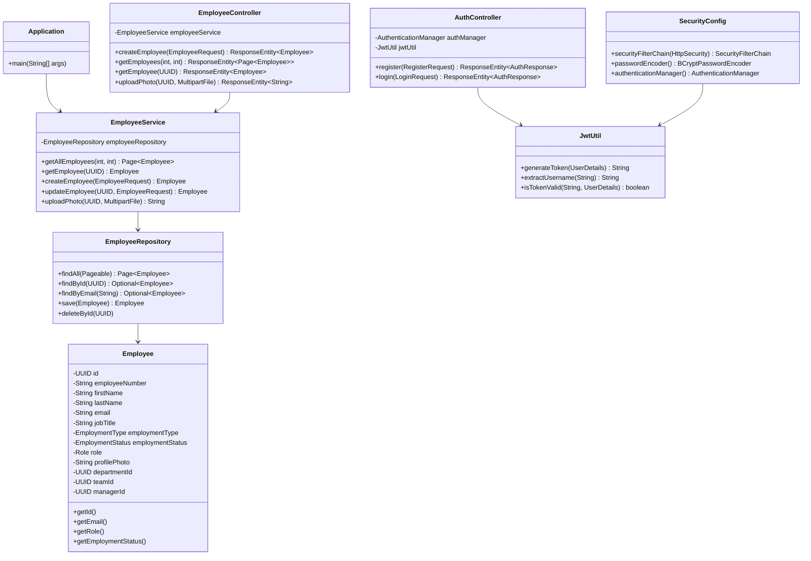

# Class Diagram

This diagram shows the core classes and their relationships in the Employee API. The application uses Spring Boot's dependency injection to wire components together. The `Employee` entity is annotated with JPA annotations for database persistence. `JwtUtil` and `SecurityConfig` handle authentication and authorization.
