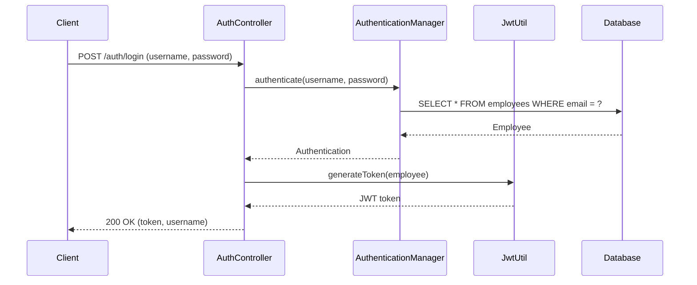
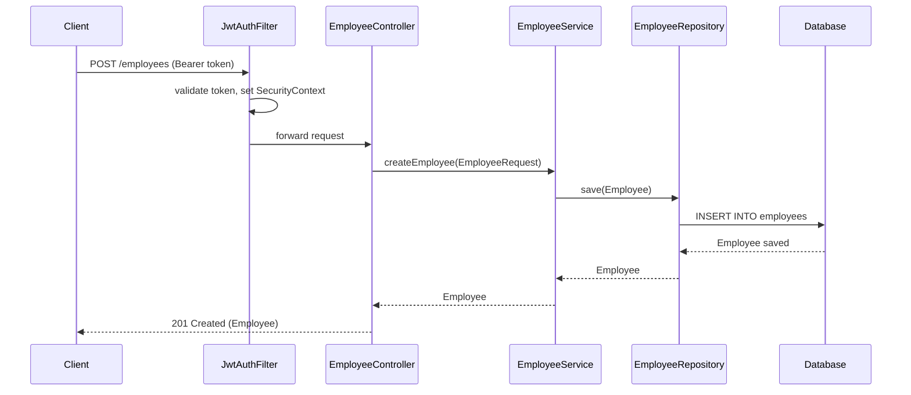
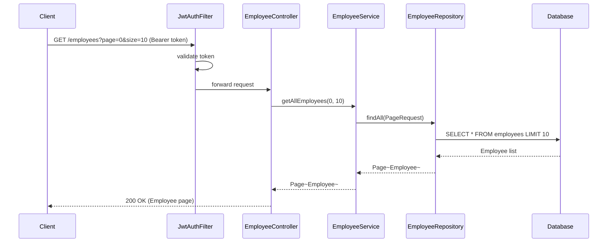
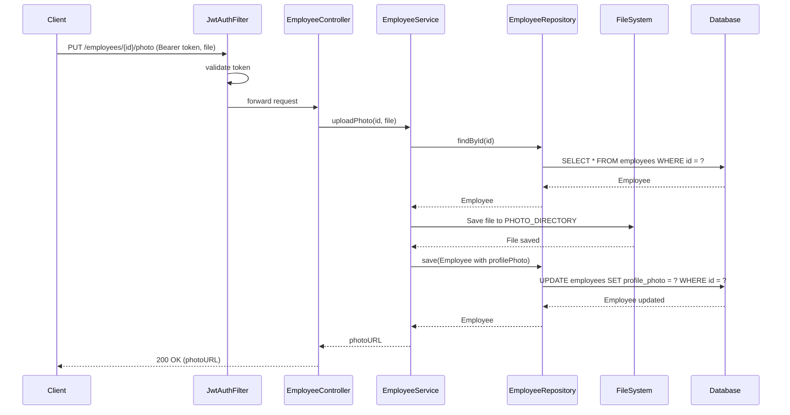

# Sequence Diagrams

## Login Flow

## Create Employee Flow

## Get Employees Flow

## Upload Photo Flow

These sequence diagrams illustrate the main interaction flows in the Employee API. The JWT filter runs on every request to authenticate the caller before the request reaches the controller.
